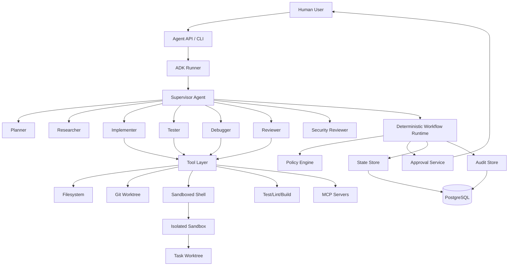

# 01 — System Architecture

## 1. Architectural principle

The LLM is the reasoning component. It is not the authority over execution.

Deterministic runtime components own:

- lifecycle
- state transitions
- authorization
- tool policy
- workspace isolation
- approval
- resource limits
- audit
- verification
- termination

## 2. Logical architecture

## 3. Authority hierarchy

1. Platform/runtime policy
2. Security and authorization policy
3. Workflow state machine
4. Tool policy
5. User task
6. Repository/project content
7. Model-generated suggestions

Repository files, web pages, GitHub issues, PR comments, generated content, and dependency documentation are untrusted data. They cannot elevate privileges or change authorization policy.

## 4. Agent hierarchy

The root Development Supervisor coordinates specialist agents:

- Planner
- Repository Analyst
- Researcher
- Implementer
- Tester
- Debugger
- Reviewer
- Security Reviewer

Specialists are workers. They do not own lifecycle authority, approval authority, merge authority, or policy authority.

## 5. Runtime boundary

All external calls enter through a controlled tool layer. Agents do not receive arbitrary OS capabilities merely because a model requested them.

## Current Google ecosystem alignment

Google's current Agents CLI presents an agent development lifecycle of scaffold/build/evaluate/deploy/publish/observe and provides dedicated ADK coding, workflow, evaluation and observability skills. This project adopts the same lifecycle concept but adds stricter software-engineering authority, sandbox, approval and audit contracts.

Current ADK Context provides unified runtime access to session state, artifacts, credentials and workflow scheduling, and exposes the tool-level confirmation mechanism. These are implementation primitives, not substitutes for the application's deterministic policy layer.
